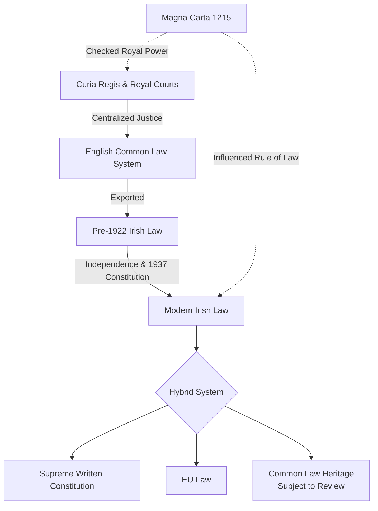

---
tags:
  - Legal_and_Professional_Issues
aliases:
---

```mermaid
graph TD
    A[Curia Regis & Royal Courts] -- Centralized Justice --> B[English Common Law System]
    B -- Exported --> C[Pre-1922 Irish Law]
    C -- Independence & 1937 Constitution --> D[Modern Irish Law]
    D --> E1{Hybrid System}
    E1 --> F1[Supreme Written Constitution]
    E1 --> F2[EU Law]
    E1 --> F3[Common Law Heritage<br/>Subject to Review]
    
    G[Magna Carta 1215] -.->|Checked Royal Power| A
    G -.->|Influenced Rule of Law| D
```

# See Also
[[$ Legal and Professional Issues]]